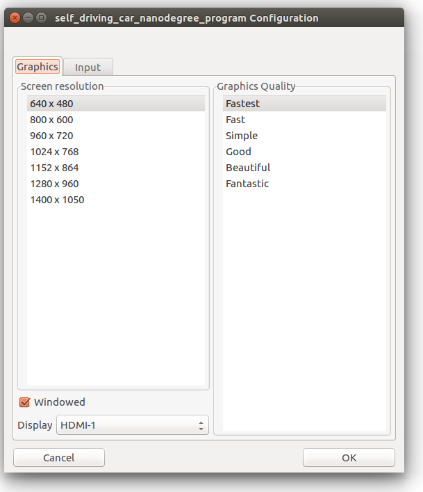

# CarND-Path-Planning-Project-P1

# Overview

In this project, we need to implement a path planning algorithms to drive a car on a highway on a simulator provided by Udacity([the simulator could be downloaded here](https://github.com/udacity/self-driving-car-sim/releases/tag/T3_v1.2)). The simulator sends car telemetry information (car's position and velocity) and sensor fusion information about the rest of the cars in the highway (Ex. car id, velocity, position). It expects a set of points spaced in time at 0.02 seconds representing the car's trajectory. The communication between the simulator and the path planner is done using [WebSocket](https://en.wikipedia.org/wiki/WebSocket). The path planner uses the [uWebSockets](https://github.com/uNetworking/uWebSockets) WebSocket implementation to handle this communication. Udacity provides a seed project to start from on this project ([here](https://github.com/udacity/CarND-Path-Planning-Project)).

# Prerequisites

The project has the following dependencies (from Udacity's seed project):

- cmake >= 3.5
- make >= 4.1
- gcc/g++ >= 5.4
- libuv 1.12.0
- Udacity's simulator.

For instructions on how to install these components on different operating systems, please, visit [Udacity's seed project](https://github.com/udacity/CarND-Path-Planning-Project). 

In order to install the necessary libraries, use the [install-ubuntu.sh](./install-ubuntu.sh).

# Compiling and executing the project
I have used "clion" IDE which help me to build , debug and run the code .

Otherhand , We can directly  build code using `make all` inside 'cmake-build-debug' folder . It will create 
make all
[ 50%] Building CXX object CMakeFiles/path_planning.dir/src/main.cpp.o
[100%] Linking CXX executable path_planning
[100%] Built target path_planning

TO run program , I used to run through IDE , using menu or we can run  through 
`/path_planning`

Now the path planner is running and listening on port 4567 for messages from the simulator. Next step is to open Udacity's simulator:

Click the "Select" button and to run the simulator.

## Compilation

### The code compiles correctly.
 A Only `spline.h`  file was added [src/spline.h](./scr/spline.h). It is the [Cubic Spline interpolation implementation](http://kluge.in-chemnitz.de/opensource/spline/): a single .h file you can use splines instead of polynomials. 

## Valid trajectories

### The car is able to drive at least 4.32 miles without incident.
I ran the simulator for 12  miles without incidents:

### The car drives according to the speed limit.
No speed limit red message was seen.

### Max Acceleration and Jerk are not Exceeded.
Max jerk red message was not seen.

### Car does not have collisions.
No collisions.

### The car stays in its lane, except for the time between changing lanes.
The car stays in its lane most of the time but when it changes lane because of traffic or to return to the center lane.

### The car is able to change lanes

The car change lanes when the there is a slow car in front of it, and it is safe to change lanes (no other cars around) or when it is safe to return the center lane.

## Reflection

Based on the provided code from the seed project, the path planning algorithms start at [src/main.cpp](./src/main.cpp#L246) line 246 to the line 416. I have done all the coding in the same function , it reduce code readabilty but easy for me to debug . 

###Code Flow : 

#### Prediction [line 255 to line 290](./src/main.cpp#L255)

Code mainly focus on deucing given below question 

- Is there a car in front of us blocking the traffic.
- Is there a car to the right of us making a lane change not safe.
- Is there a car to the left of us making a lane change not safe.

These questions are answered by calculating the lane each other car is and the position it will be at the end of the last plan trajectory. 
A car is considered "dangerous" when its distance to our car is less than 30 meters in front or behind us.

#### Behavior [line 292 to line 314](./scr/main.cpp#L293)
This part of code do the lane changing decision 
  - If we have a car in front of us, do we change lanes?
  - Do we speed up or slow down?

Based on the prediction of the situation code 
1) increases the speed, decrease speed, 
2) make a lane change when it is safe. 
Instead of increasing the speed at this part of the code, a `speed_diff` is created to be used for speed changes when generating the trajectory in the last part of the code. This approach makes the car more responsive acting faster to changing situations like a car in front of it trying to apply breaks to cause a collision.

#### Trajectory [line 317 to line 416](./scr/main.cpp#L313)
Trajectory is calculated ,based on the speed and lane output from the behavior, car coordinates and past path points.

First we check if we have previous tw point or not ,If  we have two point then we covert the point into car frame and then intialize spline (377 and 378) .if there is not two point , we have make adjustment by coping pass trajectory points .

